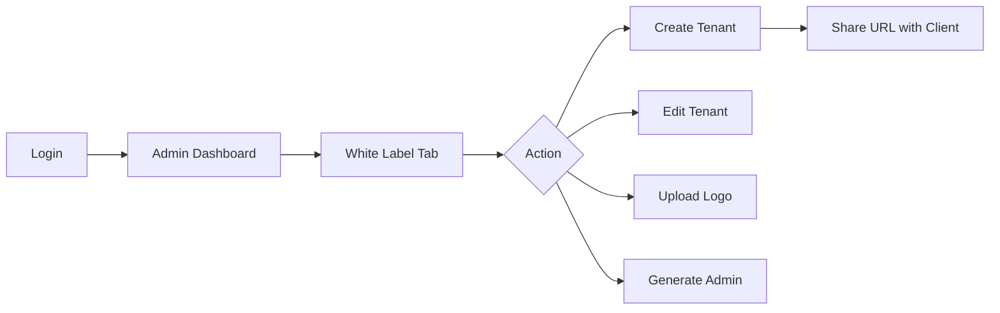
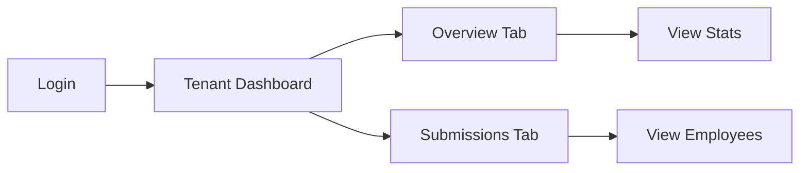
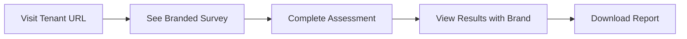

# Financial Clinic White-Label SaaS Transformation
## Product Requirements Document (PRD)

**Version:** 1.0  
**Date:** February 3, 2026  
**Author:** Clustox Development Team  
**Status:** Draft  

---

## 1. Executive Summary

### 1.1 Purpose
Transform the Financial Clinic platform from a single-tenant application into a multi-tenant SaaS solution, enabling corporate clients to access branded, isolated instances of the financial health assessment tool.

### 1.2 Business Objectives
- **Revenue Expansion:** Enable B2B licensing model where corporate clients pay for branded access
- **Market Differentiation:** Offer white-label capabilities competitors don't provide
- **Scalability:** Support unlimited corporate clients without infrastructure changes
- **Client Retention:** Provide dedicated dashboards increasing client engagement


---

## 2. Product Overview

### 2.1 Current State
The Financial Clinic is a standalone financial health assessment platform with:
- Single National Bonds branding
- Centralized admin dashboard
- Unique URL tracking for companies (`/c/:url`)
- No client-specific isolation or branding

### 2.2 Target State
A multi-tenant SaaS platform where:
- Corporate clients access via custom URLs (subdomain or path)
- Each client sees their logo alongside National Bonds
- Company admins view only their organization's data
- National Bonds retains super-admin access to all data

### 2.3 User Personas

| Persona | Role | Needs |
|---------|------|-------|
| **National Bonds Super Admin** | Internal staff | Full access to all tenants, manage white-label clients, view consolidated analytics |
| **Company Admin** | Corporate client HR | View-only access to their employees' assessments, track engagement |
| **Employee/End User** | Assessment taker | Complete branded survey, receive personalized report |

---

## 3. Feature Requirements

### 3.1 White-Label Tenant Management (Epic 1)

#### FR-1.1: Tenant CRUD Operations
**Priority:** High  
**Description:** Super admins can create, update, and deactivate white-label tenants.

**Acceptance Criteria:**
- [ ] Create tenant with: name, slug, logo, contact info
- [ ] Auto-generate URL based on slug
- [ ] Enable/disable tenant without data loss
- [ ] Delete tenant with data archival

#### FR-1.2: Logo Upload & Branding
**Priority:** High  
**Description:** Upload and manage client logos for survey branding.

**Acceptance Criteria:**
- [ ] Accept PNG/JPG up to 2MB
- [ ] Preview before activation
- [ ] Store in cloud storage (S3)
- [ ] Display alongside National Bonds logo

#### FR-1.3: Admin Dashboard Tab
**Priority:** High  
**Description:** New "White Label" tab in admin dashboard.

**Acceptance Criteria:**
- [ ] List all tenants with status
- [ ] Search and filter functionality
- [ ] Quick actions: enable, disable, edit
- [ ] View submission count per tenant

---

### 3.2 Custom URL/Subdomain (Epic 2)

#### FR-2.1: Path-Based Access (MVP)
**Priority:** High  
**Description:** Tenants accessible via `/companies/:slug`.

**Acceptance Criteria:**
- [ ] Dynamic route resolves tenant from slug
- [ ] 404 page for invalid/inactive slugs
- [ ] Tenant context propagated to all components

#### FR-2.2: Subdomain Support (Phase 2)
**Priority:** Medium  
**Description:** Tenants accessible via `{slug}.financialclinic.ae`.

**Acceptance Criteria:**
- [ ] Wildcard DNS configuration
- [ ] SSL certificate for subdomains
- [ ] Middleware extracts tenant from host header

---

### 3.3 Data Isolation & Security (Epic 3)

#### FR-3.1: Row-Level Tenant Isolation
**Priority:** Critical  
**Description:** All tenant data filtered by `tenant_id`.

**Acceptance Criteria:**
- [ ] Responses linked to tenant on submission
- [ ] Profiles linked to tenant on creation
- [ ] API queries filtered for company admins
- [ ] No cross-tenant data leakage

#### FR-3.2: Company Admin Role
**Priority:** High  
**Description:** New admin role with tenant-scoped access.

**Acceptance Criteria:**
- [ ] Role: `company_admin` in User model
- [ ] Can only view their tenant's data
- [ ] Cannot access other tenants
- [ ] Cannot export data (view-only)

#### FR-3.3: Admin User Provisioning
**Priority:** High  
**Description:** Create admin accounts for company clients.

**Acceptance Criteria:**
- [ ] Generate credentials from tenant management
- [ ] Auto-assign tenant_id to new admin
- [ ] Send welcome email with login instructions
- [ ] Password reset flow

---

### 3.4 Company Admin Dashboard (Epic 4)

#### FR-4.1: Restricted Dashboard View
**Priority:** High  
**Description:** Company admins see limited dashboard.

**Acceptance Criteria:**
- [ ] Only "Overview" and "Submissions" tabs visible
- [ ] All charts filtered to their tenant
- [ ] Export buttons hidden/disabled
- [ ] Settings/configuration hidden

#### FR-4.2: Tenant-Scoped Analytics
**Priority:** High  
**Description:** All statistics reflect only tenant's data.

**Acceptance Criteria:**
- [ ] Submission count for tenant only
- [ ] Average score for tenant only
- [ ] Status distribution for tenant only
- [ ] Time-series charts for tenant only

---

### 3.5 Survey Branding (Epic 5)

#### FR-5.1: Dual-Logo Display
**Priority:** High  
**Description:** Show client logo with National Bonds logo.

**Acceptance Criteria:**
- [ ] Logo appears on survey header
- [ ] Logo appears on results page
- [ ] Responsive sizing on mobile
- [ ] Fallback if logo fails to load

#### FR-5.2: Question Variations (Existing)
**Priority:** Medium  
**Description:** Assign custom question sets per tenant.

**Acceptance Criteria:**
- [ ] Link VariationSet to tenant
- [ ] Tenant survey uses assigned variations
- [ ] Default to standard if none assigned

---

## 4. Technical Requirements

### 4.1 Database Schema

```
┌─────────────────────────┐
│   WhiteLabelTenant      │
├─────────────────────────┤
│ id (PK)                 │
│ name                    │
│ slug (unique)           │
│ logo_url                │
│ subdomain               │
│ admin_user_ids (JSON)   │
│ variation_set_id (FK)   │
│ is_active               │
│ created_at              │
└─────────────────────────┘
         │
         │ tenant_id (FK)
         ▼
┌─────────────────────────┐
│ FinancialClinicResponse │
│ FinancialClinicProfile  │
│ IncompleteSurvey        │
│ User (company_admin)    │
└─────────────────────────┘
```

### 4.2 API Endpoints

| Method | Endpoint | Description | Auth |
|--------|----------|-------------|------|
| GET | `/admin/white-label` | List tenants | Super Admin |
| POST | `/admin/white-label` | Create tenant | Super Admin |
| PUT | `/admin/white-label/{id}` | Update tenant | Super Admin |
| DELETE | `/admin/white-label/{id}` | Delete tenant | Super Admin |
| POST | `/admin/white-label/{id}/logo` | Upload logo | Super Admin |
| GET | `/tenant/{slug}/config` | Get tenant branding | Public |

### 4.3 Security Requirements

| Requirement | Implementation |
|-------------|----------------|
| Data Isolation | SQLAlchemy query filters with tenant_id |
| Authentication | JWT with tenant claim |
| Authorization | Role-based access control |
| File Upload | Validated MIME types, size limits |
| Audit Trail | Log all tenant admin actions |

---

## 5. User Experience

### 5.1 Super Admin Flow



### 5.2 Company Admin Flow



### 5.3 Employee Flow



---

## 6. Non-Functional Requirements

### 6.1 Performance
- Tenant resolution: < 50ms latency
- Dashboard load: < 2 seconds
- Support 100+ concurrent tenants

### 6.2 Scalability
- Horizontal scaling via shared database
- CDN for logo delivery
- Caching for tenant config

### 6.3 Availability
- 99.9% uptime SLA
- Zero-downtime deployments
- Database backup every 24 hours

### 6.4 Compliance
- PDPL data residency (UAE)
- GDPR considerations for non-UAE tenants
- Audit logs retained 12 months

---

## 7. Implementation Phases

### Phase 1: Foundation (Week 1-2)
- Database schema changes
- WhiteLabelTenant model
- Alembic migrations

### Phase 2: Backend (Week 2-3)
- CRUD API endpoints
- Tenant middleware
- Data isolation logic

### Phase 3: Frontend (Week 3-4)
- Tenant context
- Admin UI
- Survey branding

### Phase 4: Routing (Week 4)
- Dynamic routes
- Login flow
- URL generation

### Phase 5: QA & Launch (Week 5)
- Security testing
- UAT with pilot client
- Documentation

---

## 8. Risks & Mitigations

| Risk | Impact | Mitigation |
|------|--------|------------|
| Data leakage between tenants | Critical | Comprehensive test suite, code review |
| Performance degradation | High | Database indexing, query optimization |
| Logo display issues | Medium | CDN, fallback images |
| Subdomain SSL | Medium | Use path-based first, subdomain later |

---

## 9. Dependencies

| Dependency | Owner | Status |
|------------|-------|--------|
| S3 bucket for logos | DevOps | Required |
| DNS wildcard config | DevOps | Phase 2 |
| SSL wildcard cert | DevOps | Phase 2 |
| SMTP for admin emails | Backend | Existing |

---

## 10. Glossary

| Term | Definition |
|------|------------|
| Tenant | A white-label corporate client instance |
| Slug | URL-safe identifier (e.g., "clustox") |
| Company Admin | Client's HR admin with view-only access |
| Super Admin | National Bonds internal admin |
| Row-Level Isolation | Data filtering based on tenant_id column |

---

## 11. Approval

| Role | Name | Date | Signature |
|------|------|------|-----------|
| Product Owner | | | |
| Tech Lead | | | |
| Client Stakeholder | | | |
